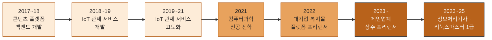

# 👋 hjseo-dev

협업을 중시하며, 동료를 돕는 것을 즐기는 책임감 있는 8년 차 개발자입니다.
해야 할 일을 마치고 느끼는 뿌듯함을 좋아하고, 지식을 공유하며 함께 성장하는 것을 중요하게 생각합니다.

---

## 💼 Career — 총 8년 1개월

- **2023.02 ~ 현재** · 게임업계 대기업 상주 프리랜서 — 사내 시스템 / 권한관리 시스템 / 예약 시스템 등 운영·개발
- **2022.02 ~ 2022.09** (8개월) · 대기업 복지몰 플랫폼 프리랜서 개발 — 관리자 화면 및 통합 서비스 기능 구현
- **2019.12 ~ 2021.04** (1년 5개월) · IoT 관제 서비스 기업 — 제조/자동차 분야 모니터링 시스템 개발
- **2018.07 ~ 2019.12** (1년 6개월) · IoT 관제 서비스 기업 — 스마트시티 디바이스 관제 서비스 개발
- **2017.05 ~ 2018.04** (1년) · 콘텐츠 플랫폼 스타트업 — 오디오/미디어 서비스 백엔드 개발

---

## 📈 Growth Timeline

---

## 🛠️ Tech Stack

**Language**

**Frontend**

**Backend / Framework**

**Database**

**Architecture / etc.**
`MSA` `RESTful API` `Ajax` `Thymeleaf` `RDBMS 설계`

**🤖 AI Agent**

- Claude Code 등 AI 코딩 에이전트를 실무 개발 프로세스에 적극 활용
- AI와의 협업을 통한 개발 생산성 개선에 관심

---

## 🏆 Certifications

- 🐧 리눅스마스터 1급 (2025.11)
- 💻 정보처리기사 (2023.09)
- 🗄️ SQL 개발자 (2021.10)

## 🎓 Education

- 컴퓨터과학과 학사 — 한국방송통신대학교

---

## 📫 Contact

- Email: hdoo831@naver.com
